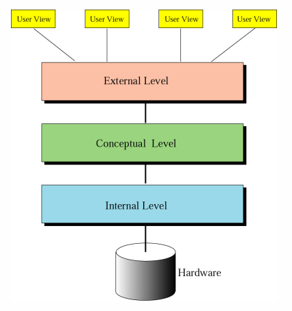

# Week 1 - Introduction

# 🎯 What Makes a Database Good?

<aside>
✨

A well-designed database is like a well-organized library — easy to access, secure, efficient, and reliable.

</aside>

**🔒 Data Integrity** — Your data stays valid and accurate

**🔓 Data Independence** — Software changes don't break your data

**🚫 No Redundancy** — Store each piece of information once

**🛡️ Data Security** — Only authorized users get access

**🔧 Easy Maintenance** — Add, delete, and optimize records smoothly

---

# 🏗️ Database Structure: From Bits to Databases

Think of it as building blocks — each level builds on the one below:

<aside>
📊

**Database** → Contains one or more tables
**Table (Relation)** → Collection of records
**Record** → Group of related fields
**Field** → One or more characters
**Character** → At least 8 bits
**Bit** → Smallest unit: 0 or 1

</aside>

💡 *Example:* A student record (row) in a Students table contains fields like Name, ID, GPA. Each character in "John" is 8+ bits. All the way down to 0s and 1s!

---

# 🏛️ Three-Level Database Architecture

Databases are viewed from three different perspectives, like looking at a building from different floors:

### 🔩 Internal Level (Physical Storage)

**Who manages it:** *Front-end developers*

**What it does:** Handles how data is physically stored on disk — the hardware layer

### 🧠 Conceptual Level (Logical Structure)

**Who manages it:** *Back-end developers*

**What it does:** Defines the overall logical structure — the "what" of your data

### 👁️ External Level (User Views)

**Who manages it:** *Database administrators*

**What it does:** Provides customized views for different users — how people interact with data

<aside>
🎯

**Why three levels?** Separating these layers means users don't need to understand physical storage, and developers can change storage without affecting users.

</aside>

---

# 🔗 Understanding Database Relations

[SQL Explained in 100 Seconds](https://youtu.be/zsjvFFKOm3c?si=tF4Z4eVMnGKu5jr0)

*Watch this video to see how tables connect and relationships work in practice.*