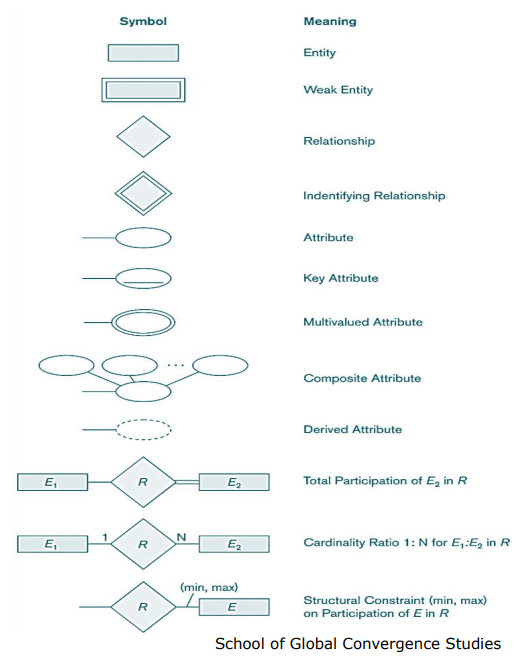

# Week 3 - Data Modeling & ER

# 🎨 Designing Database Blueprints with ER Modeling

<aside>
🗺️

Entity-Relationship modeling is like creating a blueprint for a building — it shows what pieces exist, how they connect, and what rules they follow. Master this, and you can design any database!

</aside>

## 📐 ER Diagram Cheat Sheet

---

# 🧩 Building Blocks: Entities & Attributes

### What Are Entities?

**Entities** are the "things" in your world — students, employees, products, orders. Each entity is described by **attributes** (properties).

<aside>
💼

**Example:** An Employee entity has attributes like Name, SSN, Address, Sex, BirthDate

</aside>

Every attribute has a **domain** (value set) — the allowed values it can take:

- SSN → 9-digit number
- Name → String (up to 50 characters)
- BirthDate → Date
- Status → Enum (Active, Inactive, On Leave)

---

## 🎯 Types of Attributes: Simple to Complex

**🔹 Simple** — Can't be divided further (SSN, Sex, Age)

**🔹 Composite** — Made of sub-parts

> Address = Street + City + State + ZipCode
> 

**🔹 Multi-valued** — Can hold multiple values

> Car.Colors = {Red, Black} — a car painted two colors!
> 

**🔹 Nested** — Composite AND multi-valued

> Student.PreviousDegrees = [{Degree, University, Year}, {Degree, University, Year}]
> 

---

# 🔑 Entity Types, Keys & Sets

<aside>
📦

**Entity Type:** A category of entities with the same attributes (all Employees, all Students)
**Entity Set:** The actual collection of entities currently in your database
**Key Attribute:** Uniquely identifies each entity — underlined in diagrams

</aside>

💡 Think of it like classes in programming: **Entity Type** is the class definition, **Entity Set** is all the instances currently in memory.

**Mathematical view:**

- `Attribute : EntitySet → ValueSet` — each attribute maps an entity to a value
- For multi-valued: `Attribute : EntitySet → PowerSet(ValueSet)` — maps to a *set* of values

---

# 🎨 ER Diagram Visual Language

Learn to speak ER:

**📦 Rectangle** = Entity

**⭕ Oval** = Attribute

**🔤 Underline** = Key attribute

**💎 Diamond** = Relationship

---

# 🔗 Relationships: How Entities Connect

Relationships are associations between entities — the connections that make your database come alive!

### Classic Examples

**WORKS_FOR** → Employee to Department (N:1)

> Many employees work for one department
> 

**WORKS_ON** → Employee to Project (M:N)

> Many employees work on many projects
> 

**SUPERVISION** → Employee to Employee (recursive!)

> Employees supervise other employees
> 

### Relationship Degree

- **Binary** (degree 2) — most common, connects 2 entities
- **Ternary** (degree 3) — connects 3 entities
- **N-ary** — connects n entities

---

# ⚖️ Constraints: The Rules of the Game

## 🔢 Cardinality Ratios

Define how many of one entity can relate to another:

- **1:1** — One person has one passport
- **1:N** — One department has many employees
- **N:1** — Many employees belong to one department
- **M:N** — Many students take many courses

## 🎯 Participation Constraints

**Total participation (mandatory)** — drawn with **double line**

> Every employee *must* work for a department
> 

**Partial participation (optional)** — drawn with **single line**

> Not every employee manages a department
> 

## 📊 (Min, Max) Notation

More precise constraints: **(min, max)** next to each entity

> Employee **(1,1)** ——WORKS_FOR——> **(4,50)** Department
> 

> 
> 

> Translation: Each employee works for exactly 1 department. Each department has between 4 and 50 employees.
> 

---

# 🔓 Weak Entities: Entities That Need Support

Some entities can't exist alone — they depend on an **owner entity**.

<aside>
⚠️

**Example:** A Dependent (child, spouse) can't exist without an Employee. The dependent's partial key (Name) + the Employee's SSN together form the full identity.

</aside>

**Visual cues:**

- Weak entity → **double rectangle**
- Identifying relationship → **double diamond**
- Partial key → **dashed underline**

---

# 🎁 Relationship Attributes

Relationships themselves can have attributes!

**WORKS_ON** (Employee × Project) → **HoursPerWeek**

> The "hours" doesn't belong to the employee or project alone — it belongs to the *relationship* between them.
> 

---

# 🌐 Higher-Degree Relationships

Sometimes two entities aren't enough! **Ternary relationships** connect three entities at once.

**SUPPLY** → Supplier × Part × Project

> "Which supplier supplies which parts to which projects?"
> 

⚠️ **Warning:** You *can't* always decompose higher-degree relationships into multiple binary ones without losing meaning!

---

# 🏛️ UML: The Alternative Notation

- https://en.wikipedia.org/wiki/Unified_Modeling_Language
- https://www.geeksforgeeks.org/system-design/unified-modeling-language-uml-introduction/
- https://youtu.be/6XrL5jXmTwM?si=p99P8G0vXpa2hCz-

**UML Class Diagrams** offer another way to model databases, especially popular in object-oriented design:

**Class** = Entity Type (shown as a box with 3 sections)

1. Class name
2. Attributes
3. Operations (methods)

**Associations** = Relationships (lines connecting classes)

**Tools:** Rational Rose, Oracle Designer, Visual Paradigm

---

# 🛠️ ER Modeling Tools

**Popular tools:** ERwin, ER-Studio, Rational Rose, Oracle Designer

**✅ Pros:** Visual design, auto-documentation, collaboration

**⚠️ Cons:** Often focus on relational models, limited support for relationship attributes

---

# 🎓 Key Takeaways

<aside>
✨

**Master these concepts:**

📦 **Entities** — The "nouns" of your database
🏷️ **Attributes** — Simple, composite, multi-valued, nested
🔗 **Relationships** — Binary, ternary, recursive
⚖️ **Constraints** — Cardinality (1:1, 1:N, M:N) & participation (total/partial)
🔓 **Weak Entities** — Dependent on owner entities
📐 **Notations** — ER diagrams, UML, (min, max)

</aside>

💡 **Pro tip:** Start with entities and attributes, then add relationships, then fine-tune with constraints. Like painting — rough sketch first, then details!